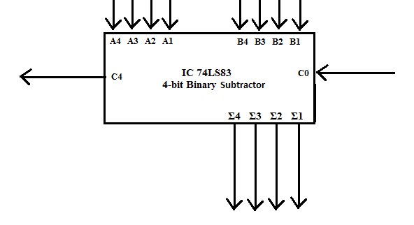
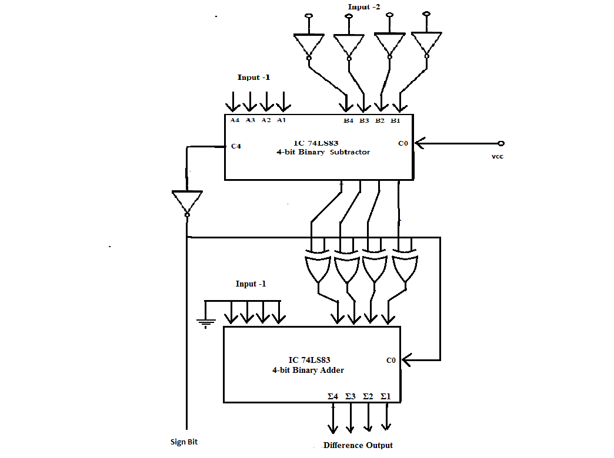
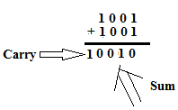
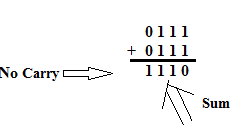

IC 74LS83 is a 4-bit parallel binary adder chip. It adds/subtracts a four-bit number (nibble) with another 4-bit number. The block symbol for the IC is shown in Fig.1. This IC has two sets of 4-bit inputs along with a carry input C0. It performs binary subtraction on the A &amp; B inputs and the carry input C0. It generates a 4-bit Difference and a Borrow out C4.

 
Fig. 1 Block Symbol of four-bit Subtractor IC  

A circuit that can subtract 4-bit numbers can be designed using a control input and additional EX-OR IC 74LS86 &nbsp;For this we use the EX-OR gate as a &ldquo;Controlled Inverter&rdquo;. The explaination for this concept can be easily understood from Fig.2. The four bit input B4, B3, B2 &amp; B1 can be passed through the controlled inverter IC74LS83 and the A4, A3, A2 &amp; A1 are connected directly to A inputs of IC 74LS83 as shown in Fig 3. 

 
Fig.2. Exclusive-OR gate used as a Controlled Inverter  

 

 
Fig.3. 4-bit Binary Subtractor 

<strong>Four-bit Subtraction: </strong>When Control input is set = 1, the Carry &ndash;in input C0 = 1. In this situation, the Ex-OR gates will provide 1,&rsquo;s complement of the Input-2 to the B-inputs of Adder IC. Moreover as C0 = 1, the addition of 1 to the 1&rsquo;s complement of B gives 2&rsquo;s complement of B.Now the IC74LS83 adds Input-1 i.e. A4,A3, A2,A1 to the 2&rsquo;s complemet of B and produces the Carry and Sum output on C4 &amp; the lines &Sigma;4, &Sigma;3, &Sigma;2, &amp; &Sigma;1.  <strong><em>Example</em></strong><strong>1</strong><em>:</em> Let Input-1 = A4 A3 A2 A1 = 1001 &amp; Input-2 = 0111 &amp; control input be set to 1.1&rsquo;s complement of 0111 = 1000. Since carry input C0 = 1, the input B becomes, B4 B3 B2 B1 = 1000 + 1 = 1001. Now IC 74LS83 performs addition of A &amp; 2,s complement of B and produces the output. 
 
 Since a Carry is generated <em>discard the Carry</em> and the Sum is the final output of subtraction operation. The result is &Sigma;4 &Sigma;3 &Sigma;2 &amp; &Sigma;1 = 0 0 1 0.  <em><b>Example</b></em></strong><strong>2</strong><em>:</em> Let Input-1 = A4 A3 A2 A1 = 0111 &amp; Input-2 = 1001 &amp; control input be set to 1. 1&rsquo;s complement of Input-2 i.e. 1001 = 0110&nbsp; Since carry input C0 = 1, the input B becomes, B4 B3 B2 B1 = 0110 + 1 = 0111. Now IC 74LS83 performs addition of A &amp; 2&rsquo;s complement of B and produces the output. 
 
 In this case <em>no Carry</em> is generated during addition. Hence the answer can be obtained by taking the <em>2&rsquo;s complement</em> of the Sum output and <em>attaching a negative sign.</em>So the 2&rsquo;s complement of 1110 = 0010 and the final result of subtraction is &Sigma;4 &Sigma;3 &Sigma;2 &amp; &Sigma;1 = - 0 0 1 0.&nbsp;&nbsp;&nbsp;

#### Numerical:

For subtracting two number, the 2&#39;s complement of
one number is calculated and then added to other number

To calculate 2&#39;s complement of a number, the 1&#39;s
complement of number is calculated i.e. number is represented in binary format,
and then inverted. And then add 1 to it.

For eg.:&nbsp;&nbsp;&nbsp;&nbsp;&nbsp;&nbsp;&nbsp; Complement of 2
is:

&nbsp;&nbsp;&nbsp;&nbsp;&nbsp;&nbsp;&nbsp;&nbsp;&nbsp;&nbsp;&nbsp;&nbsp;&nbsp;&nbsp;&nbsp;&nbsp;&nbsp;&nbsp;&nbsp;&nbsp;&nbsp;&nbsp;&nbsp;&nbsp;&nbsp;&nbsp;&nbsp;&nbsp;
2&nbsp;&nbsp;&nbsp;&nbsp;&nbsp;&nbsp;&nbsp;
&nbsp;&nbsp;&nbsp;&nbsp;&nbsp;&nbsp;&nbsp;&nbsp;&nbsp;
=&gt;&nbsp;&nbsp;&nbsp;&nbsp; 0010

&nbsp;&nbsp;&nbsp;&nbsp;&nbsp;&nbsp;&nbsp;&nbsp;&nbsp;&nbsp;&nbsp;&nbsp;&nbsp;&nbsp;&nbsp;&nbsp;&nbsp;&nbsp;
1&#39;s complement&nbsp;&nbsp;&nbsp;&nbsp; =&gt;&nbsp;&nbsp;&nbsp;&nbsp; 1101

&nbsp;&nbsp;&nbsp;&nbsp;&nbsp;&nbsp;&nbsp;&nbsp;&nbsp;&nbsp;&nbsp;&nbsp;&nbsp;&nbsp;&nbsp;&nbsp;&nbsp;&nbsp;
2&#39;s complement&nbsp;&nbsp;&nbsp;&nbsp; =&gt;&nbsp;&nbsp;&nbsp;&nbsp; 1101&nbsp; + 1&nbsp;&nbsp;&nbsp;&nbsp; =&gt; 1110

&nbsp;&nbsp;&nbsp;&nbsp;&nbsp;&nbsp;&nbsp;&nbsp;&nbsp;
Hence 2&#39;s complement of 2 is 1110.

&nbsp;&nbsp;&nbsp;&nbsp;&nbsp;&nbsp;&nbsp;&nbsp;&nbsp;&nbsp;&nbsp;&nbsp;&nbsp;&nbsp;&nbsp;&nbsp;&nbsp;&nbsp;

Examples:

1.&nbsp;&nbsp;&nbsp;&nbsp;
&nbsp;&nbsp;&nbsp;&nbsp;1.&nbsp;&nbsp;4
- 0

&nbsp;

2&#39;s Complement
of&nbsp;&nbsp; 0&nbsp; =&nbsp; 1 0000

&nbsp;

<table class=MsoNormalTable border=0 cellspacing=0 cellpadding=0
 >
 <tr >
  <td width=25 valign=top >
  
&nbsp;

  </td>
  <td width=168 valign=top >
  
4

  </td>
  <td width=17 valign=top >
  
&nbsp;

  </td>
  <td width=24 valign=top >
  
0

  </td>
  <td width=24 valign=top >
  
1

  </td>
  <td width=24 valign=top >
  
0

  </td>
  <td width=24 valign=top >
  
0

  </td>
 </tr>
 <tr >
  <td width=25 valign=top s>
  
+

  </td>
  <td width=168 valign=top >
  
2&#39;s
  complement of 0

  </td>
  <td width=17 valign=top >
  
&nbsp;1

  </td>
  <td width=24 valign=top >
  
0

  </td>
  <td width=24 valign=top >
  
0

  </td>
  <td width=24 valign=top >
  
0

  </td>
  <td width=24 valign=top >
  
0

  </td>
 </tr>
 <tr >
  <td width=25 valign=top >
  
&nbsp;

  </td>
  <td width=168 valign=top >
  
4

  </td>
  <td width=17 valign=top >
  
1

  </td>
  <td width=24 valign=top >
  
0

  </td>
  <td width=24 valign=top >
  
1

  </td>
  <td width=24 valign=top >
  
0

  </td>
  <td width=24 valign=top >
  
0

  </td>
 </tr>
</table>

&nbsp; <o:p></o:p>

&nbsp;&nbsp;&nbsp;&nbsp;&nbsp;&nbsp;&nbsp;&nbsp;&nbsp;(The
MSB bit is complemented to achieve the Sign-bit)

&nbsp;&nbsp;&nbsp;&nbsp;&nbsp;&nbsp;&nbsp;&nbsp;&nbsp;
Sign Bit = 0 (Positive Number)

&nbsp;

&nbsp;

2.&nbsp;&nbsp;&nbsp;&nbsp;
&nbsp;&nbsp;&nbsp;&nbsp;2.&nbsp;&nbsp;4
- 2

&nbsp;

2&#39;s Complement
of&nbsp;&nbsp; 2&nbsp; =&nbsp; 0 1110

&nbsp;

<table class=MsoNormalTable border=0 cellspacing=0 cellpadding=0
 >
 <tr >
  <td width=25 valign=top >
  
&nbsp;

  </td>
  <td width=168 valign=top >
  
4

  </td>
  <td width=17 valign=top >
  
&nbsp;

  </td>
  <td width=24 valign=top >
  
0

  </td>
  <td width=24 valign=top >
  
1

  </td>
  <td width=24 valign=top >
  
0

  </td>
  <td width=24 valign=top >
  
0

  </td>
 </tr>
 <tr >
  <td width=25 valign=top s>
  
+

  </td>
  <td width=168 valign=top >
  
2&#39;s
  complement of 2

  </td>
  <td width=17 valign=top >
  
0

  </td>
  <td width=24 valign=top >
  
1

  </td>
  <td width=24 valign=top >
  
1

  </td>
  <td width=24 valign=top >
  
1

  </td>
  <td width=24 valign=top >
  
0

  </td>
 </tr>
 <tr >
  <td width=25 valign=top >
  
&nbsp;

  </td>
  <td width=168 valign=top >
  
2

  </td>
  <td width=17 valign=top >
  
1

  </td>
  <td width=24 valign=top >
  
0

  </td>
  <td width=24 valign=top >
  
0

  </td>
  <td width=24 valign=top >
  
1

  </td>
  <td width=24 valign=top >
  
0

  </td>
 </tr>
</table>

&nbsp;

&nbsp;&nbsp;&nbsp;&nbsp;&nbsp;&nbsp;&nbsp;&nbsp;&nbsp;Sign
Bit = 0 (Positive Number)

&nbsp;

3.&nbsp;&nbsp;&nbsp;&nbsp;
&nbsp;&nbsp;&nbsp;&nbsp;3.&nbsp;&nbsp;2
- 4

&nbsp;

2&#39;s Complement
of&nbsp;&nbsp; 4&nbsp; =&nbsp; 1100

&nbsp;

<table class=MsoNormalTable border=0 cellspacing=0 cellpadding=0
 >
 <tr >
  <td width=25 valign=top >
  
&nbsp;

  </td>
  <td width=168 valign=top >
  
2

  </td>
  <td width=17 valign=top >
  
&nbsp;

  </td>
  <td width=24 valign=top >
  
0

  </td>
  <td width=24 valign=top >
  
0

  </td>
  <td width=24 valign=top >
  
1

  </td>
  <td width=24 valign=top >
  
0

  </td>
 </tr>
 <tr >
  <td width=25 valign=top s>
  
+

  </td>
  <td width=168 valign=top >
  
2&#39;s
  complement of 4

  </td>
  <td width=17 valign=top >
  
&nbsp;0

  </td>
  <td width=24 valign=top >
  
1

  </td>
  <td width=24 valign=top >
  
1

  </td>
  <td width=24 valign=top >
  
0

  </td>
  <td width=24 valign=top >
  
0

  </td>
 </tr>
 <tr >
  <td width=25 valign=top >
  
&nbsp;

  </td>
  <td width=168 valign=top >
  
14

  </td>
  <td width=17 valign=top >
  
&nbsp;0

  </td>
  <td width=24 valign=top >
  
1

  </td>
  <td width=24 valign=top >
  
1

  </td>
  <td width=24 valign=top >
  
1

  </td>
  <td width=24 valign=top >
  
0

  </td>
 </tr>
</table>

&nbsp;

&nbsp;&nbsp;&nbsp;&nbsp;&nbsp;&nbsp;&nbsp;&nbsp;&nbsp;Sign
Bit = 1 (Negative Number)<o:p></o:p>

<o:p>&nbsp;</o:p>

 &nbsp;&nbsp;&nbsp;&nbsp;&nbsp;&nbsp;&nbsp;&nbsp;&nbsp;As
the output is negative number, it is in the 2&#39;s complement format. Hence the
2&#39;s complement of Answer need to be taken, to achieve
the right answer:<o:p></o:p>

 &nbsp;&nbsp;&nbsp;&nbsp;&nbsp;&nbsp;&nbsp;&nbsp;&nbsp;Answer =&gt; 1110<o:p></o:p>

 &nbsp;&nbsp;&nbsp;&nbsp;&nbsp;&nbsp;&nbsp;&nbsp;&nbsp;1&#39;s
Complement  =&gt; 0001<o:p></o:p>

&nbsp;&nbsp;&nbsp;&nbsp;&nbsp;&nbsp;&nbsp;&nbsp;&nbsp;2&#39;s
Complement =&gt; 0001 + 1 = 0010<o:p></o:p>

&nbsp;&nbsp;&nbsp;&nbsp;&nbsp;&nbsp;&nbsp;&nbsp;&nbsp;Hence,
final answer = 0010 with Sign bit =
1<o:p></o:p>

